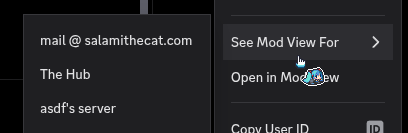

# MutualModView

Allows you to open the Mod View on Users for any Mutual Server you're in with them as long as you have the required permission in said server (or you're using showHiddenThings)

## Example

works when clicking on users in your dm list as well
